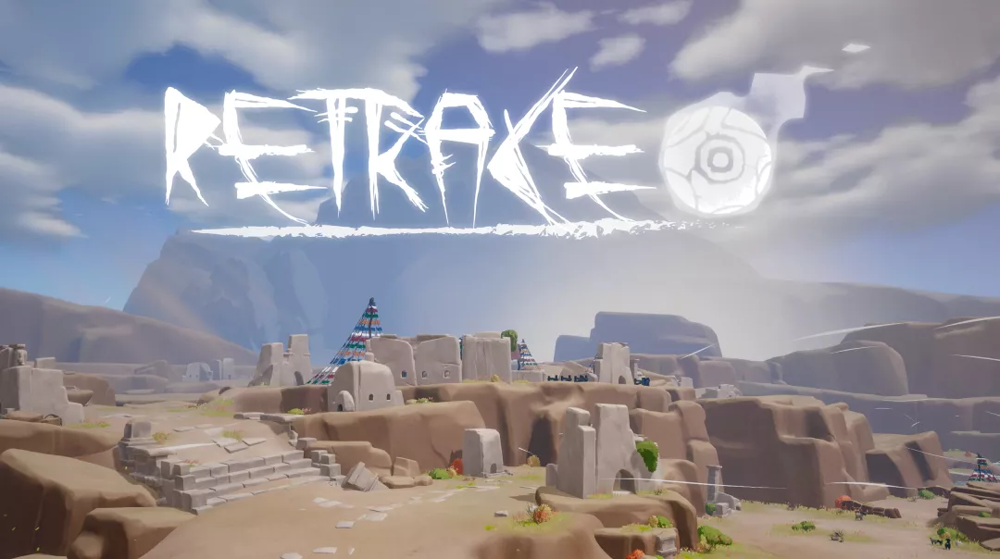
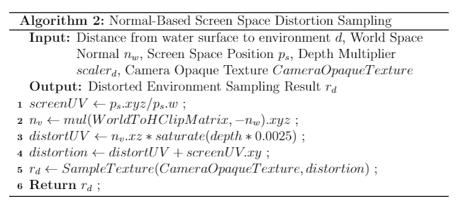

# UnityInteractableWater-Grass-Wind_URP
This is a technical project split from the Final bachelor project of mine containing only the scripts and shaders about interactable water, grass, wind and other.

Co-creator of the game: Jiang Minmin and Liang Lantian from Jiang Nan University.

Web page of the game: https://zoroiscrying.itch.io/retrace.

Unity URP, Version - 2019.4.18f1c1.

## Showcase Footage

- Global Wind 3D (2D Wind Noise Texture + 1D Offset of Y)
- Interactable Stylized Depth-based Coloration Water
- Interactable Point-Cloud and Geometry Shader Based Grass
  - Noise Based Color Randomization
  - Deformed by Global Wind 3D
- Stylized Flag - Generated and Edited (vertex color that guide movement strength) via Houdini.
- Stylized Tree - Generated via Houdini.

## Game Footage

## Water

Algorithm explanation pictures:

## Grass

Algorithm explanation pictures:

Custom Unity Editor Point-Cloud Mesh Manipulation Tool

- In-Editor Add / Remove / Edit / Grass Vertex Attribute Smooth Paint modes
- Scriptable Object Brush Settings
- Undo/Redo, Prefab Edit Support

## Wind

## Extras

Fake Volumetric Cloud Rendering:

