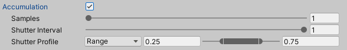

Enable the **Accumulation** feature to [render multiple sub-frames](https://docs.unity3d.com/Packages/com.unity.render-pipelines.high-definition@10.3/manual/Accumulation.html) and accumulate them on each final recorded frame. The two main purposes of this feature are:
* High frame rate capture to produce motion blur effect on fast moving elements.
* [Path tracing convergence](https://docs.unity3d.com/Packages/com.unity.render-pipelines.high-definition@10.3/manual/Ray-Tracing-Path-Tracing.html) to reduce noise for improved image quality.

>[!NOTE]
>The use of the **Accumulation** feature is subject to very specific conditions:
>* Your project must use [HDRP (High Definition Render Pipeline)](https://docs.unity3d.com/Packages/com.unity.render-pipelines.high-definition@latest).
>* You can only select **Game View** or **Targeted Camera** as the **Source** for the recording.
>* You can only use one active Recorder at a time when you capture accumulation.
>* You cannot enable the Accumulation feature through a Recorder Clip (in Timeline).

|Property||Function|
|:---|:---|:---|
| **Samples** || The number of sub-frames to capture and accumulate between two subsequent frames. |
| **Shutter Interval** || The portion of the interval between two subsequent frames in which the Recorder actually applies the specified **Shutter Profile**.  • A value of 1 applies the shutter profile to the whole interval between the two frames. • A value of 0 disables the shutter and the accumulation. • Any value in between proportionally rescales the shutter profile and makes the shutter remain closed for the rest of the interval to the next frame. |
| **Shutter Profile** || Allows you to define a custom response profile that simulates the physical motion of a camera shutter at each frame when the Recorder captures the sub-frames. |
|| Range | Select this type to use a trapezoidal shutter profile. Specify two values to define the time range in which the shutter remains fully open.  • The values, between 0 and 1, are relative to the full length of the shutter profile. • The shutter opening and closing portions (from 0 to the first value, and from the second value to 1) are linear.|
|| Curve | Select this type to use an animation curve as the shutter profile. [Select or draw a curve](https://docs.unity3d.com/Manual/EditingCurves.html) according to your needs. |
