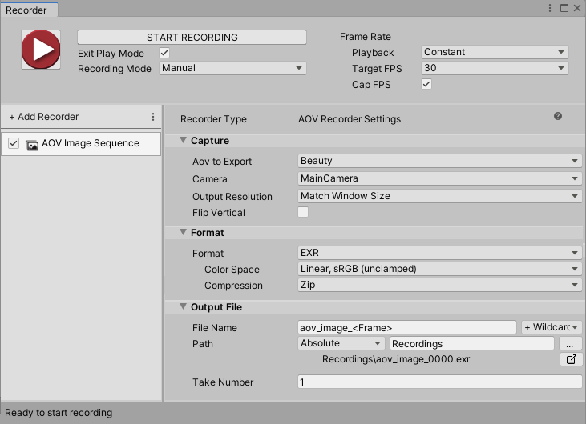

# AOV Image Sequence Recorder properties

AOV recording is a process that extracts specific render pass data from the Scene that a specific Camera views. This mainly includes render passes related to the material, geometry, depth, motion, and lighting response of the GameObjects in the Scene.

The AOV Recorder only works with projects that use Unity's [HDRP (High Definition Render Pipeline)](https://docs.unity3d.com/Packages/com.unity.render-pipelines.high-definition@latest). It generates a sequence of image files in various formats including compressed EXR and supports the recording of [several different AOVs](#aov-to-export) for various [use cases](#use-case-examples).

>**Note:** This AOV Recorder replaces the one that was formerly available through a separate package. If you previously installed the separate AOV Recorder package, you should uninstall it to avoid any unexpected recording issues.

This page covers all properties specific to the AOV Image Sequence Recorder type.

> **Note:** To fully configure any Recorder, you must also set the general recording properties according to the recording interface you are using: the [Recorder window](RecorderWindowRecordingProperties.md) or a [Recorder Clip](RecordingTimelineTrack.md#recorder-clip-properties).

The AOV Recorder properties fall into three main categories:
* [Capture](#capture)
* [Format](#format)
* [Output File](#output-file)

## Capture

Use this section to define the source and the content of your recording. It includes settings to select the [AOV to export](#aov-to-export), select the [source camera](#source-camera) to use for the recording, and adjust other properties of the [recorded view](#recorded-view).

### AOV to Export

Select the type of AOV to record according to your needs.

**Tip:** Review the [list of use case examples](#use-case-examples) to get some more perspective and help you make your selection.

The following table describes for each one the type of data recorded in each frame and the meaning behind the value of a single pixel.

| AOV | Recorded data | Pixel value |
|:---|:---|:---|
| Beauty | The final rendered view (after post-process) without the alpha. | RGB color. |
| Albedo | The overall perceived colors of the surfaces in view, with no lighting calculation and no shadows. This includes data from albedo values or albedo maps of the surface materials. | RGB color. |
| Normals | The normals of the surfaces in view, resulting from geometric normals and materials normal maps. | R, G and B channels: The values of the R,G,B channels respectively represent the X,Y,Z vector coordinates of the normals in World Space. |
| Smoothness | The glossiness or roughness of the surfaces in view. This includes data from smoothness values or smoothness maps of the surface materials. | Grayscale: • Black (value of 0) = rough • White (value of 1) = glossy |
| Ambient Occlusion | The ambient occlusion data from the material maps of the surfaces in view. This does not include data resulting from any ambient occlusion effects. | Grayscale: • Black (value of 0) = fully occluded • White (value of 1) = not occluded |
| Metal | The metallic or non-metallic surfaces in view. This includes data from metal values or metal maps of the surface materials. | Grayscale: • Black (value of 0) = non-metal • White (value of 1) = metal |
| Specular | The specular colors of the surfaces in view. This includes data from specular color values or specular color maps of the surface materials. | RGB color. |
| Alpha | The transparency or opacity of the surfaces in view. This includes data from alpha values or alpha maps of the surface materials. | Grayscale: • Black (value of 0) = transparent • White (value of 1) = opaque |
| Diffuse Lighting* | The direct _and_ indirect diffuse light response of the surfaces in view. | RGB color. |
| Specular Lighting* | The direct _and_ indirect specular light response of the surfaces in view. | RGB color. |
| Direct Diffuse* | Only the direct diffuse light response of the surfaces in view. | RGB color. |
| Direct Specular* | Only the direct specular light response of the surfaces in view. | RGB color. |
| Indirect Diffuse* | Only the indirect diffuse light response of the surfaces in view. | RGB color. |
| Reflection* | The light reflected by the surfaces in view. | RGB color. |
| Refraction* | The light refracted through the surfaces in view. | RGB color. |
| Emissive* | The light emitted by the surfaces in view. | RGB color. |
| Motion Vectors | The 2D vectors representing the movements in the Scene, relative to the recording Camera. | R and G channels only: • The values of the R and G channels respectively represent the horizontal and vertical coordinates of the vectors in the image plane. • The range of values is between -1 and 1, normalized to the **Output Resolution** you selected for the recording. |
| Depth | The relative distances of the Scene elements in view between the Far Plane (farthest point from the camera) and the Near Plane (closest point to the camera). | Grayscale: • Black (value of 0) = at Far Plane • White (value of 1) = at Near Plane |

_\* These specific AOVs are for light decomposition purposes. The recorded data depends on the current lighting of the Scene and on the surface materials, and includes shadows._

### Source camera

Select the camera to use for the recording.

| Property || Function |
|:---|:---|:---|
| **Camera** || Specifies which camera the Recorder uses to capture the AOV recording.  **Note:** [You can't set the Camera property to ActiveCamera](KnownIssues.md#activecamera-recording-not-available-with-srps) due to a High Definition Render Pipeline (HDRP) limitation. |
|| MainCamera | The Camera tagged with the MainCamera [Tag](https://docs.unity3d.com/Manual/Tags.html). |
|| TaggedCamera | A camera tagged with a specific [Tag](https://docs.unity3d.com/Manual/Tags.html).  If you select this option, you must enter a value in the **Tag** field. |
|**Tag** || Specifies which Camera Tag to look for when you set **Camera** to **Tagged Camera**. |

### Recorded view

Set the dimensions and other properties of the recorded view.

| Property || Function |
|:---|:---|:---|
| **Output Resolution** || Allows you to set the dimensions of the recorded view using different methods. |
|   | Match Window Size  | Matches the resolution and aspect ratio of the currently selected Game View. |
|   | _[PRESET RESOLUTIONS]_ | Choose from several standard video resolutions such as FHD (1080p) and 4K (2160p).  The numeric value represents the image height. To set the image width, you must select a specific **Aspect Ratio**. |
|   |  Custom | Uses custom width and height values that you supply in the **W** and **H** fields. |
| **Aspect Ratio** || Specifies the ratio of width to height (w:h) of the recorded view when you set the **Output Resolution** to a preset resolution. |
|   | _[PRESET ASPECT RATIOS]_ | Choose from several standard aspect ratios such as 16:9 (1.7778) and 4:3 (1.3333). |
|   | Custom   | Uses custom aspect ratio that you supply in the displayed fields (w:h). |
| **Flip Vertical** || When you enable this option, the Recorder flips the output image vertically.  This is useful to correct for systems that output video upside down. |

## Format

Use this section to set up the media format you need to save the recorded images in.

| Property | | Function |
|:---|:---|:---|
| **Format** | | The file encoding format.  Choose **PNG**, **JPEG**, or **EXR** ([OpenEXR](https://en.wikipedia.org/wiki/OpenEXR)). The Recorder encodes EXR in 16 bits. |
| **Color Space** | | The color space (gamma curve and gamut) to use in the output images. |
|  | sRGB, sRGB | Uses sRGB curve and sRGB primaries. |
|  | Linear, sRGB (unclamped) | Uses linear curve and sRGB primaries. This option is only available when you set the **Format** to **EXR**.  **Important:** To get the expected unclamped values in the output images, you must:  • Disable any Tonemapping post-processing effects in your Scene (menu: **Edit > Project Settings > HDRP Default Settings** and deselect **Tonemapping**) and in any Volume that includes a Tonemapping override (select the Volume, navigate in the Inspector and deselect **Tonemapping** if present).  • Disable **Dithering** on the Camera selected for the capture (in the Inspector, navigate to **General** and deselect **Dithering**). |
| **Compression** | | The compression method to apply when saving the data.  This property is only available when you set the **Format** to **EXR**. |
|  | None | Disables all compression. |
|  | Zip | Applies deflate compression to blocks of 16 scanlines at a time. This is the default selection. |
|  | RLE | Applies [Run-length encoding](https://en.wikipedia.org/wiki/Run-length_encoding) compression.  |

## Output File

Use this section to specify the output **Path** and **File Name** pattern to save the recorded image files.

> **Note:** [Output File properties](OutputFileProperties.md) work the same for all types of recorders.

## Use case examples

You can record AOV render passes to finalize your look in post-processing or composite real-time 3D images with live action plates. For example:

* Render background plates in Unity and composite them with characters rendered offline, or with actors filmed against a green screen.

* Record Motion Vectors to apply motion blur in a separate compositing tool.

* Record Depth pass to apply depth of field in a separate compositing tool.

* Record Normal and Depth render passes in order to composite them for further re-lighting.

* Record Alpha and Depth render passes to isolate multiple alpha mattes according to the actual distances of objects in the Scene.
